<!-----
NEW: Check the "Suppress top comment" option to remove this info from the output.

Conversion time: 22.956 seconds.

Using this Markdown file:

1. Paste this output into your source file.
2. See the notes and action items below regarding this conversion run.
3. Check the rendered output (headings, lists, code blocks, tables) for proper
   formatting and use a linkchecker before you publish this page.

Conversion notes:

* Docs to Markdown version 1.0β30
* Tue Jul 27 2021 11:19:31 GMT-0700 (PDT)
* Source doc: README
* Tables are currently converted to HTML tables.
* This document has images: check for >>>>>  gd2md-html alert:  inline image link in generated source and store images to your server. NOTE: Images in exported zip file from Google Docs may not appear in  the same order as they do in your doc. Please check the images!

----->

>>>>>  gd2md-html alert:  ERRORs: 0; WARNINGs: 0; ALERTS: 48.

<ul style="color: red; font-weight: bold"><li>See top comment block for details on ERRORs and WARNINGs. <li>In the converted Markdown or HTML, search for inline alerts that start with >>>>>  gd2md-html alert:  for specific instances that need correction.</ul>

Links to alert messages:
<a href="#gdcalert1">alert1</a>
<a href="#gdcalert2">alert2</a>
<a href="#gdcalert3">alert3</a>
<a href="#gdcalert4">alert4</a>
<a href="#gdcalert5">alert5</a>
<a href="#gdcalert6">alert6</a>
<a href="#gdcalert7">alert7</a>
<a href="#gdcalert8">alert8</a>
<a href="#gdcalert9">alert9</a>
<a href="#gdcalert10">alert10</a>
<a href="#gdcalert11">alert11</a>
<a href="#gdcalert12">alert12</a>
<a href="#gdcalert13">alert13</a>
<a href="#gdcalert14">alert14</a>
<a href="#gdcalert15">alert15</a>
<a href="#gdcalert16">alert16</a>
<a href="#gdcalert17">alert17</a>
<a href="#gdcalert18">alert18</a>
<a href="#gdcalert19">alert19</a>
<a href="#gdcalert20">alert20</a>
<a href="#gdcalert21">alert21</a>
<a href="#gdcalert22">alert22</a>
<a href="#gdcalert23">alert23</a>
<a href="#gdcalert24">alert24</a>
<a href="#gdcalert25">alert25</a>
<a href="#gdcalert26">alert26</a>
<a href="#gdcalert27">alert27</a>
<a href="#gdcalert28">alert28</a>
<a href="#gdcalert29">alert29</a>
<a href="#gdcalert30">alert30</a>
<a href="#gdcalert31">alert31</a>
<a href="#gdcalert32">alert32</a>
<a href="#gdcalert33">alert33</a>
<a href="#gdcalert34">alert34</a>
<a href="#gdcalert35">alert35</a>
<a href="#gdcalert36">alert36</a>
<a href="#gdcalert37">alert37</a>
<a href="#gdcalert38">alert38</a>
<a href="#gdcalert39">alert39</a>
<a href="#gdcalert40">alert40</a>
<a href="#gdcalert41">alert41</a>
<a href="#gdcalert42">alert42</a>
<a href="#gdcalert43">alert43</a>
<a href="#gdcalert44">alert44</a>
<a href="#gdcalert45">alert45</a>
<a href="#gdcalert46">alert46</a>
<a href="#gdcalert47">alert47</a>
<a href="#gdcalert48">alert48</a>

>>>>> PLEASE check and correct alert issues and delete this message and the inline alerts.

# Milestone 3

Team Name: **VEDR **

    Proposed Level of Achievement:** Apollo 11**

    Idea Concept**: **A community platform that offers academic services tailored for university students.

Deployment: [nusxchange.herokuapp.com](http://nusxchange.herokuapp.com) 

(y[ou can try searching for “bt” to find BT coded listings that we have populated with](http://nusxchange.herokuapp.com/search/bt))

Note: database has been wiped since milestone 2 to accommodate for better password hashing

Codebase:[ https://github.com/cyyeu/nusXchange](https://github.com/cyyeu/nusXchange)

## **Recap from Previous Milestone**

**Problem**

When students require **academic help** in their modules or just want general assignment and** university advice**, current alternatives are friends, seniors and self-organised telegram groups. 

However, these options hinge upon students successfully seeking out connections with fellow coursemates and seniors. However, this may not be 100% viable given that:

1. In light of the Covid-19 pandemic, most classes in universities are still run online. As such, it may be difficult for freshmen to make meaningful connections.
2. Self-organised telegram groups are often isolated & unofficial in nature, hence not all students may be aware of the presence of such groups. Even then, some of these telegram groups may not be 100% active, so students may not get the timely help required.
3. Friends & seniors may not be able to answer questions posed, especially given that the questions tend to be module-specific and their ability to answer will hinge upon their proficiency (grade attained) at the module.

**Solution**

We have streamlined this process by creating a platform where users can sign up as tutors and offer help and tutoring services to fellow coursemates. Named “nusXchange”, this service aims to bridge the existing gap we have identified.

Additionally, we have implemented an extractive text summarizer built based on Google’s BERT to expedite readings and summarise essays. The summarizer is currently able to take raw input & web urls to new articles and will output a customized summary based on the provided input parameters.

**How We Differ**

1. **Teaching Assistants (TAs)**

    Although most modules include TAs to provide extra help to students and often this is sufficient, TAs might not be able to provide tutoring help which is specific to a student’s ability level, given that they **have their own commitments** as well as **other students to attend to**. By offering a platform to connect tutors and students, **nusXchange **aims to enable students to get **1 to 1 academic help** which is **catered to their individual ability level.** This can be particularly useful for weaker students to catch up. 

2. **Carousell**

    Carousell is a classifieds marketplace that lets users sell goods and services, including tuition services. A quick search on carousell for NUS modules (CS1K, MA1K) yields listings that **only provide courseware** and do not offer personalised tutoring. **nusXchange **aims to fill this gap by offering a platform for the purpose of **personalised tutoring** services** catered specifically for NUS modules**.

**User Stories**

**Essential Features**

1. As a user, I want to be able to use social media to sign up and log in for convenience.
2. As a user, after I log in, I am able to change my password and personal information.
3. As a user, after I log in, I am able to upload an image to use as my profile picture and can edit it. 
4. As a student who has doubts about my module content, I want to be able to seek a tutor to help me out with that specific module/subject by searching a module code or subject. I should get a list of tutor profiles that best matches my search, and I should be able to sort and filter this list according to my needs (price range, available days, tutor level) so that I can further find my best fit for a tutor.
5. As a student, once I find a tutor that fits my needs, I want to be able to chat up the tutor to get more details and schedule consultations with the tutor directly through the platform.
6. As a student who wants to get a quick summary of a tediously long reading/article/essay, I want to be able to summarize my text into a summarized version. I should be able to choose the percentage of text to output. Additionally, I should be able to summarize news sites and other web urls.

 

7. As a tutor, I want to be able to create a tutor profile that encapsulates my qualifications, achievements that showcases my knowledge and competency. I want to be able to choose the option to teach for free (for passion, or gain reputation/reviews etc), or charge a price for my tutoring.
8. As a tutor, I want students who need help with the subject I am teaching to be able to find and reach out to me via the website directly.
9. As an administrator who wants to prevent abuse of the system, I want to be able to manage users by identifying abusers, warn them and ban them if they continue to cause problems.
10. As a user, I should be able to view reviews of the tutors and also have an easily identifiable system (levels & tiered badges) to easily recognise reputable tutors.
11. As a tutor, I want to be able to include my telegram handle so other users have an alternate means of communication, and also include my linkedin to increase my credibility.

**Good to have Features**

1. As a tutor, I would like to have a leaderboard system so that I am recognised for my teaching efforts and have my efforts highlighted so that more students can reach out to me.
2. As a student, I should be able to report errant tutors who are misusing the website to the website administrators.

## **Follow up from Milestone 2**

### **Features and Changes**

#### Changes made based on feedback

<table>
  <tr>
   <td>Feedback 
   </td>
   <td>Action
   </td>
   <td>Comments
   </td>
  </tr>
  <tr>
   <td>Overflow when creating a listing with  multiple dates selected
   </td>
   <td><strong>Changed</strong> - swapped to Icon button instead to avoid implementing a large & awkward input field.
   </td>
   <td>
   </td>
  </tr>
  <tr>
   <td>Sidebar in profile does not render correctly on smaller screen sizes (&lt;1280px)
   </td>
   <td><strong>Fixed</strong>
   </td>
   <td>
   </td>
  </tr>
  <tr>
   <td>More appropriate error message for the password input field.
   </td>
   <td><strong>Changed</strong> - users will be prompted to provide an 8 character alphanumeric password.
   </td>
   <td>
   </td>
  </tr>
  <tr>
   <td>Module code regex not detecting 4 letter coded mods and invalid modules.
   </td>
   <td><strong>Changed</strong> - regex should now detect 4 letter coded modules.
   </td>
   <td><em>Invalid modules: decided against it as the nusmods’ API pulls a full list of modules offered for the AY which may affect the performance of our website.</em>

<em>Invalid module codes can be easily rectified using the <strong>edit listing feature.</strong></em>
   </td>
  </tr>
  <tr>
   <td>Form validation (Edit Profile) - socials input are not properly validated.

Can put malicious url as linkedin profile url and validation to check whether users included “@” in their handle.
   </td>
   <td><strong>Changed</strong> - regex pattern to allow only valid linkedin urls from being passed in. Telegram handle field will now check for invalid chars.
   </td>
   <td><em>Telegram handle field includes additional “@” symbol as a handy reminder to users.</em>
   </td>
  </tr>
  <tr>
   <td>Form validation (Summarizer)
<ul>

<li>No validation for input fields
</li>
</ul>
   </td>
   <td><strong>Changed</strong> - basic validation to check for positive values. Check to ensure “min_length” is less than “max_length”.

Check to ensure only valid urls are provided.
   </td>
   <td><em>Url validation only checks for valid urls, does not check whether the url is a news link / article link.</em>
   </td>
  </tr>
  <tr>
   <td>Users able to  edit calendar on listing page/listing cards
   </td>
   <td><strong>Changed</strong> - Calendars are now read-only where applicable 
   </td>
   <td>
   </td>
  </tr>
  <tr>
   <td>Loading spinner icon
   </td>
   <td><strong>Added - </strong>Buttons and pages should now have loading spinner icons when awaiting response from the backend.
   </td>
   <td>
   </td>
  </tr>
</table>

#### New Features

<table>
  <tr>
   <td>Feature
   </td>
   <td><strong>Action</strong>
   </td>
   <td><em>Comments</em>
   </td>
  </tr>
  <tr>
   <td>SMTP server
   </td>
   <td><strong>Added</strong> - hookup gmail SMTP server to backend for mailing services
   </td>
   <td>
   </td>
  </tr>
  <tr>
   <td>Email validation
   </td>
   <td><strong>Added </strong>- confirmation email will be sent to the registered email.
   </td>
   <td><em>Verified users will now have a green tick on their profiles.</em>

<em>[verify button can be found in ur own profile page]</em>
   </td>
  </tr>
  <tr>
   <td>Password reset
   </td>
   <td><strong>Added </strong>-<strong> </strong>password reset email will be sent to the registered email.
   </td>
   <td>[can be found in /login > Forgot Password button]
   </td>
  </tr>
  <tr>
   <td>Tiering System
   </td>
   <td><strong>Added </strong> - badges to distinguish tutors and add to gamification factor
   </td>
   <td>[can be found in profile/ listing page]
   </td>
  </tr>
  <tr>
   <td>Testing
   </td>
   <td><strong>Added </strong> - frontend and backend tests
   </td>
   <td>
   </td>
  </tr>
  <tr>
   <td>Default sorting
   </td>
   <td><strong>Changed </strong>- search results will now be sorted by owner’s exp level / tier by default
   </td>
   <td>
   </td>
  </tr>
  <tr>
   <td>Code cleanup
   </td>
   <td><strong>Changed </strong>- Increase code quality by abstracting out more components, custom react hooks and validation checks in frontend
   </td>
   <td>
   </td>
  </tr>
  <tr>
   <td>Polish UI
   </td>
   <td><strong>Changed </strong>- Improved UI styling and layout
   </td>
   <td>
   </td>
  </tr>
</table>

## **Project Scope**

### **System Architecture**

#### Overview

nusXchange is a full-stack web application with Django 3 as backend and ReactJS with material-ui components as frontend. A detailed overview of our system architecture can be viewed below. 

    

>>>>>  gd2md-html alert: inline image link here (to images/image1.png). Store image on your image server and adjust path/filename/extension if necessary.  (<a href="#">Back to top</a>)(<a href="#gdcalert2">Next alert</a>) >>>>> 

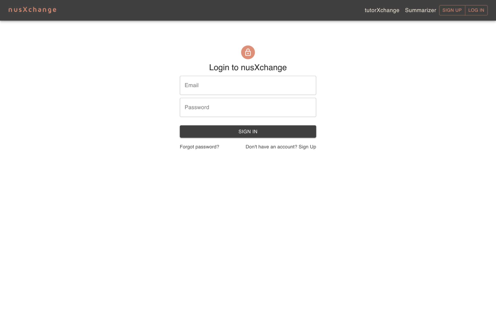

#### Rationale

1. Django backend
    1. ORM: object-relational mapper allows easy interaction with PostgreSQL by automatically transferring data into objects, which minimizes the need to write SQL queries, thus speeding up the web development process.
    2. Default admin panel: Django automatically comes up with an admin interface which is highly customizable, allowing us to perform CRUD operations to test our API without having to write a custom admin panel, thus facilitating the development process.
    3. Django auth : Django’s built in token authentication nicely fits our security needs for our web application. It’s plug and play capability allows for us to develop the backend with more ease, and so that we do not need to reinvent the wheel when it comes to authentication and password hashing.
2. React + Material-UI frontend framework
    4. Large library of components which are highly customizable and the default css can be easily overridden to fit the theme of the website. This is especially helpful due to the strict time constraint, since less time is spent building components from scratch.
    5. Material UI adheres to Material Design by Google, which will look and feel familiar to most users. The provided icon library further complements our design system.

### **Code Style**

We use [Prettier](https://prettier.io/) to automate code styling. Prettier allows for an automated way of producing a consistent code style, thereby saving us time and energy from manual code styling.  This allows for us to focus on the more important aspects of the code, and ultimately improve code quality. Furthermore, by ensuring a standardised style is used to improve readability, it smoothens the collaborative work process.

### **Version Control **

We use Git for version control in the following ways:

1. For each feature, we create a sub branch (for example feat/profile-frontend), and work on the feature. Once done and tested, we merge it into the master branch. 

    

>>>>>  gd2md-html alert: inline image link here (to images/image2.png). Store image on your image server and adjust path/filename/extension if necessary.  (<a href="#">Back to top</a>)(<a href="#gdcalert3">Next alert</a>) >>>>> 

    [Diagram credit](https://towardsdatascience.com/version-control-with-jupyter-notebooks-f096f4d7035a?gi=5f0d479fa1a7)

2. For deployment, we create a separate deploy branch. Then, we compile the react frontend files in production mode (to optimize bundle size), switch django to production mode, and deploy the branch on heroku.

### **Development Process**

For each milestone, our development process can be summarised into:

1. Using the initial high-fidelity prototype, decide on pages to be created.
2. Allocate tasks on Trello and meet to discuss frontend design and requirements from backend (API endpoints to fetch data etc).
3. Work on tasks separately and perform regular check-ins / debugging.
4. Submission and await peer feedback.
5. Work on bug fixes / improvements based on feedback received.

Creating an initial prototype was essential to the development process as it allowed us to better **visualize** the **requirements** of each aspect of the project through each stage of development. Moreover, it **forced us to think through our project** to a much greater degree to decide what was realistic and test the user experience firsthand before development, so as to figure out how to better optimize it. Finally, prototyping was essential to derive our API endpoints and database relation models, as it provided a good visualization of the problem at hand and what data was required at each step.

### **Project Management**

Trello was employed to keep track of the project’s progress as well as tasks required. It provides us with the big picture for each milestone of what has to be done, and streamlines the collaborative workflow.

>>>>>  gd2md-html alert: inline image link here (to images/image3.png). Store image on your image server and adjust path/filename/extension if necessary.  (<a href="#">Back to top</a>)(<a href="#gdcalert4">Next alert</a>) >>>>> 

### **Third Party Libraries**

We would like to mention a few useful third party libraries we are using that helped us greatly in developing nusXchange.

1. Authentication library: Dj-rest-auth
    1. Out-of-the-box set of REST API endpoints to handle user registration and authentication tasks, email verification, password reset. These endpoints are web-browsable which facilitates easy testing and debugging.
2. Cloudinary
    2. Cloud based image delivery with an easy to use React SDK for seamless integration with our tech stack. It offers simple to use image transformations which enhances customizability. 
    3. Users are assigned an avatar_id which is initially empty. When a profile picture is uploaded, a unique avatar_id is then assigned to the user model for repeated image delivery. 

### **UI/UX Design**

#### Client-side Form Validation

In order to emulate professional web development, we decided to include form validation whenever possible. This is easily witnessed in our “Sign up” page as well as “create a listing” page.

Sign Up

>>>>>  gd2md-html alert: inline image link here (to images/image4.png). Store image on your image server and adjust path/filename/extension if necessary.  (<a href="#">Back to top</a>)(<a href="#gdcalert5">Next alert</a>) >>>>> 

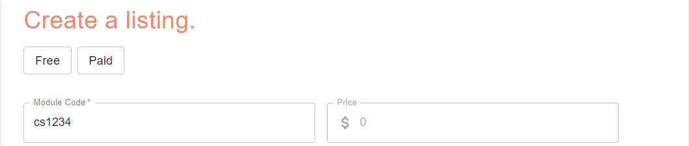

Fields are validated using string validators and inline validation is practiced - errors are reflected to the user under each corresponding field and are specific in nature. This requires the least interaction cost for users, allowing errors to be easily rectified. Moreover, form submission is disabled until all required fields / errors are corrected, thus catching errors on the client-side even before a response is sent to our backend. 

Create a Listing

Negative example

>>>>>  gd2md-html alert: inline image link here (to images/image5.png). Store image on your image server and adjust path/filename/extension if necessary.  (<a href="#">Back to top</a>)(<a href="#gdcalert6">Next alert</a>) >>>>> 

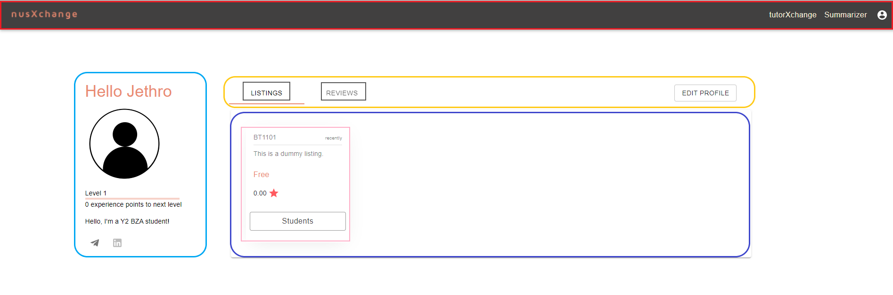
 

Negative example mimicking module code pattern

>>>>>  gd2md-html alert: inline image link here (to images/image6.png). Store image on your image server and adjust path/filename/extension if necessary.  (<a href="#">Back to top</a>)(<a href="#gdcalert7">Next alert</a>) >>>>> 

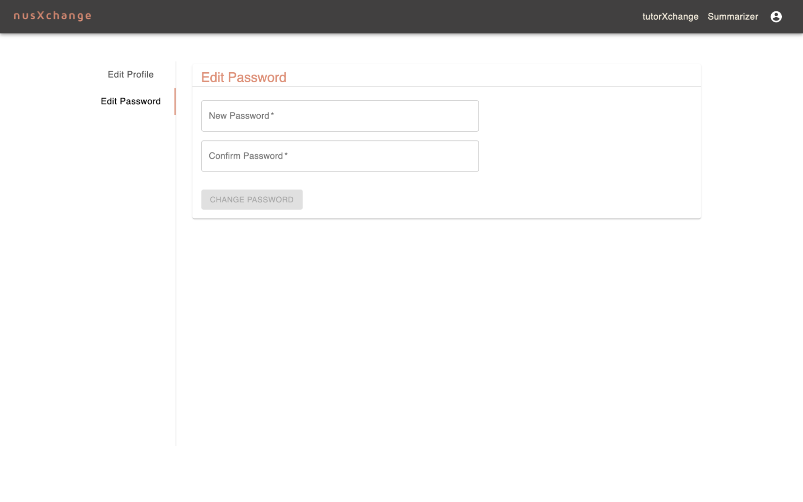

Positive example

>>>>>  gd2md-html alert: inline image link here (to images/image7.png). Store image on your image server and adjust path/filename/extension if necessary.  (<a href="#">Back to top</a>)(<a href="#gdcalert8">Next alert</a>) >>>>> 

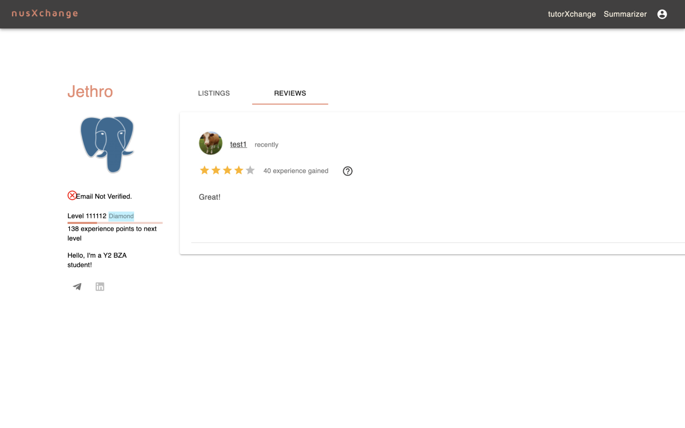

Module code is validated using regex which searches for: i) 2-4 alphabets (case-insensitive), followed by ii) first number indicating the module level (1-4), final 3 numbers and an optional alphabet at the end of the code (fringe cases such as MA1101R). 

When creating a new listing, users are only able to select dates starting from the current day of creation, thus preventing an invalid listing from being generated.

>>>>>  gd2md-html alert: inline image link here (to images/image8.png). Store image on your image server and adjust path/filename/extension if necessary.  (<a href="#">Back to top</a>)(<a href="#gdcalert9">Next alert</a>) >>>>> 

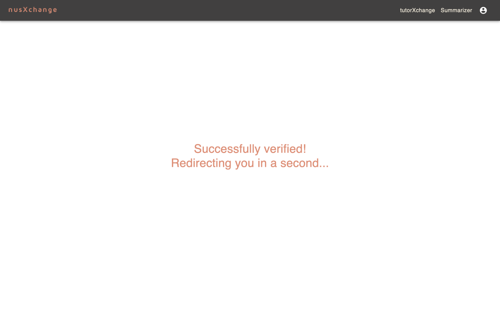

**Advantages of Form validation**

As mentioned previously, by ensuring all required form controls are filled and in the correct format before submitting data to the server, it helps to **improve the user experience**. By catching errors and invalid data on the client-side, users can rectify the error **immediately**. If invalid data is sent to the server and rejected, a** noticeable delay** is caused by a round trip to the server which **degrades the user experience**. That being said, our backend still validates the requests as a double check that all information processed is valid.

Inline validation is also practiced by showing errors under individual form controls, which reduces the need for users to trawl through forms to locate the error, therefore enhancing the user experience. 

#### Informative Feedback

Each time a user performs an action,  a meaningful and clear reaction is shown in the form of a snackbar indicating whether the action performed was successful, with different coloured snackbars indicating the severity of reaction. (blue, green, red).

>>>>>  gd2md-html alert: inline image link here (to images/image9.png). Store image on your image server and adjust path/filename/extension if necessary.  (<a href="#">Back to top</a>)(<a href="#gdcalert10">Next alert</a>) >>>>> 

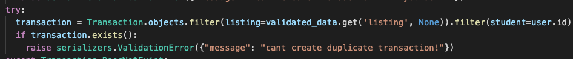

>>>>>  gd2md-html alert: inline image link here (to images/image10.png). Store image on your image server and adjust path/filename/extension if necessary.  (<a href="#">Back to top</a>)(<a href="#gdcalert11">Next alert</a>) >>>>> 

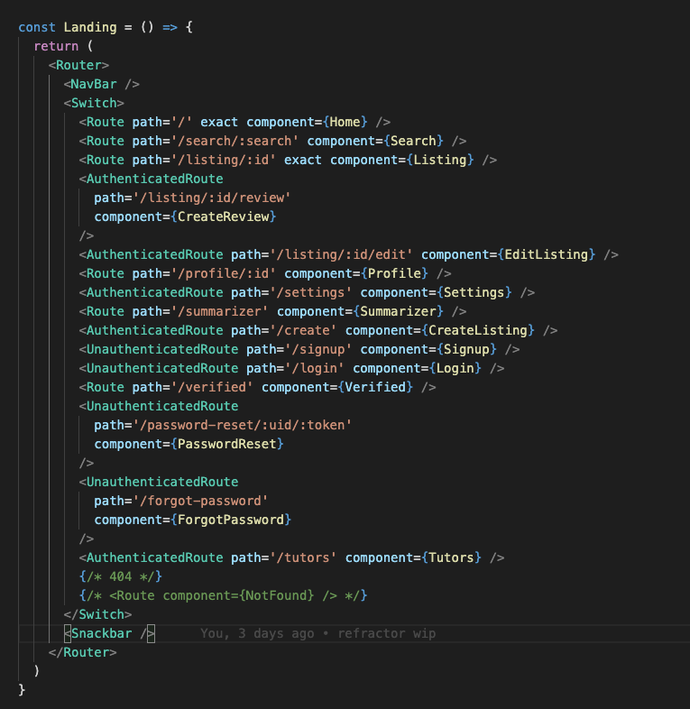

#### Route Handling

Route validation ensures that the user is not able to visit a link when it does not make sense.  (e.g going to /login when already logged in)

We have identified 3 types of routes a user can go to:

1. Authenticated route \
Only logged in users can visit these routes. If the user is not logged in, they are automatically redirected to the home page. (e.g /settings, /create)
2. Unauthenticated routes \
Only users that are not logged in can visit these routes. If the user is logged in, they are automatically redirected to the home page. (e.g /login, /signup)
3. Normal routes \
Any user can visit these routes.

>>>>>  gd2md-html alert: inline image link here (to images/image11.png). Store image on your image server and adjust path/filename/extension if necessary.  (<a href="#">Back to top</a>)(<a href="#gdcalert12">Next alert</a>) >>>>> 

### **Design Principles**

#### Abstraction 

To simplify UI design, UI components such as the snackbars and buttons are abstracted out for code reusability, whilst still allowing for customizability, such as changing messages and colours.

Another method by which abstraction is utilised is whereby components were written to encapsulate code often reused throughout our frontend (form validators, snackbar notifications etc).

For example, the following component snippet (left) is used to handle form input value changes and provide us a way to validate these input values. This component is used extensively in pages where form handlers and validators are required. Doing so allows code to be reused, with minimal changes required such as only changing the validation and error messages shown.

Form change handler & validator in Summarizer page

>>>>>  gd2md-html alert: inline image link here (to images/image12.png). Store image on your image server and adjust path/filename/extension if necessary.  (<a href="#">Back to top</a>)(<a href="#gdcalert13">Next alert</a>) >>>>> 

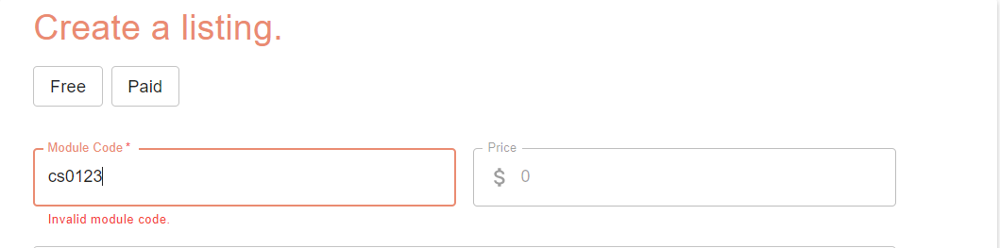

Same form change handler  used in Signup page

>>>>>  gd2md-html alert: inline image link here (to images/image13.png). Store image on your image server and adjust path/filename/extension if necessary.  (<a href="#">Back to top</a>)(<a href="#gdcalert14">Next alert</a>) >>>>> 

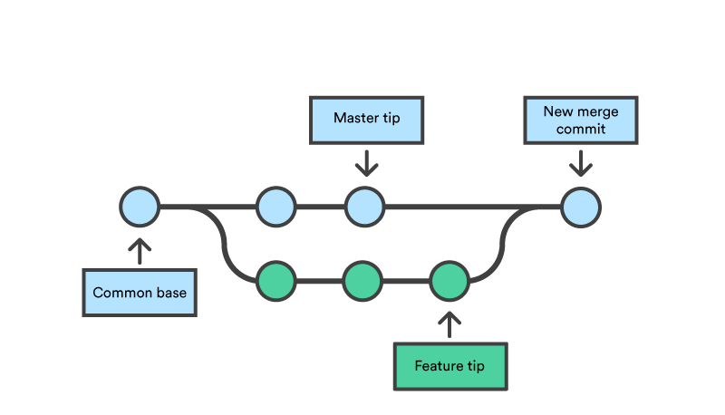

#### Component Based Architecture (CBA)

In order to abide by the Single Responsibility Principle as closely as possible, our frontend design strived to adhere to component based architecture. This is done by splitting requirements into separate functional components. The advantages of such a structure include ease of debugging and making changes to one component without affecting the other parent / child components.

Example CBA in Profile Page

>>>>>  gd2md-html alert: inline image link here (to images/image14.png). Store image on your image server and adjust path/filename/extension if necessary.  (<a href="#">Back to top</a>)(<a href="#gdcalert15">Next alert</a>) >>>>> 

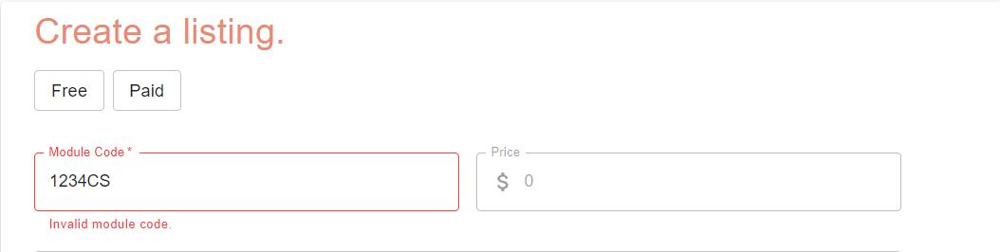
 

>>>>>  gd2md-html alert: inline image link here (to images/image15.png). Store image on your image server and adjust path/filename/extension if necessary.  (<a href="#">Back to top</a>)(<a href="#gdcalert16">Next alert</a>) >>>>> 

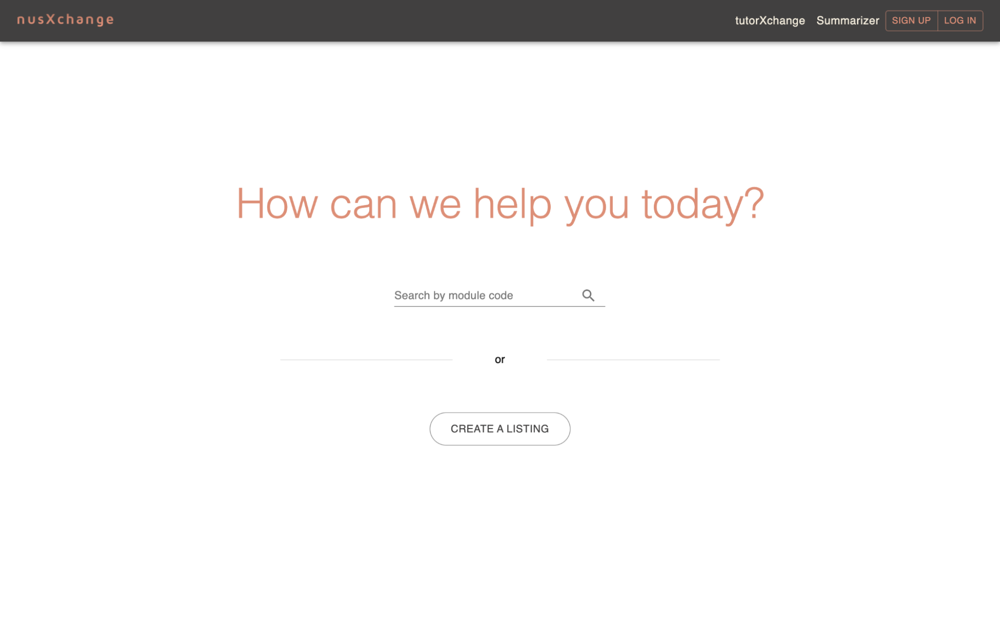

In the above webpage, NavBar (red) serves as a static global component which appears on every webpage for easy navigation. Next, Profile is a parent component containing 2 child components, Sidebar (blue) and Profile Panel (yellow). It controls the styling between components as well as the page margins.

Sidebar

1. Responsible for fetching and rendering personal information about the user, such as their profile image and biography. 
2. Handles onClick events to external telegram / linkedin profiles.
3. Handles styling between grid items.

Profile Panel

1. Contains two child components, Listings and Reviews.
2. Responsible  for rendering & switching between the Listings tab and the Reviews tab.

Listings/Reviews (grey)

1. Responsible for the styling between listing/review cards. Since the styling between listings and reviews are different, they are controlled separately within each individual tab.
2. Handles the fetching of data for every listing/review belonging to the user, and mapping these data to individual listing/review cards. Data is passed down to the child components (listing/review card) as a prop.

ListingCard/ReviewCard (pink)

1. Receives data from their parent component as a prop to be rendered.
2. Controls the styling between grid items within the card.

**Advantages of CBA**

This intuitive component based structure has allowed our UI codebase to be organized and maintainable.  Moreover, it has also allowed the reuse of certain components when needed, thus speeding up the development process.

For example, the sidebar component (blue) within the listing page utilises the same code as the sidebar within the profile page, with minimal styling changes. Doing so not only sped up development time but also maintained the same look and styling throughout our website.

>>>>>  gd2md-html alert: inline image link here (to images/image16.png). Store image on your image server and adjust path/filename/extension if necessary.  (<a href="#">Back to top</a>)(<a href="#gdcalert17">Next alert</a>) >>>>> 

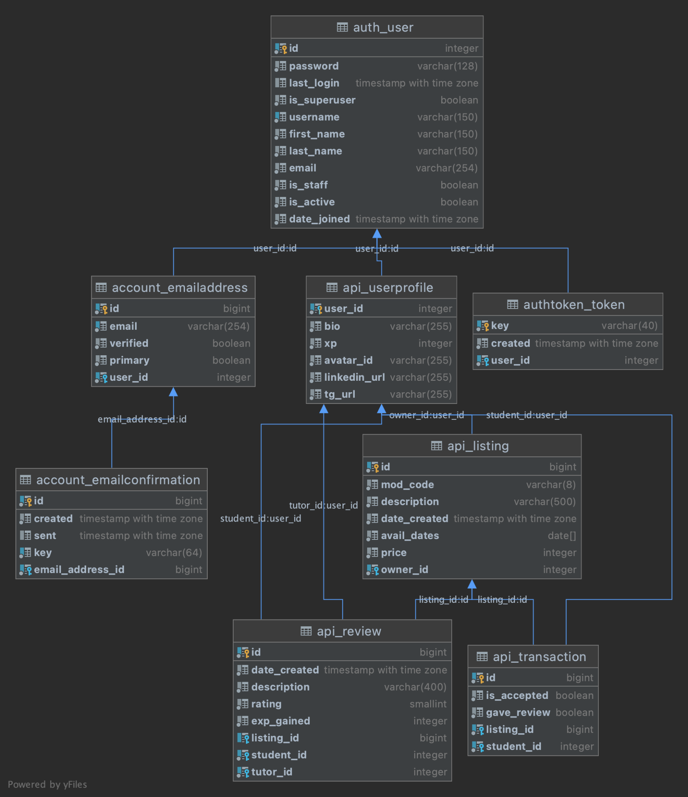

>>>>>  gd2md-html alert: inline image link here (to images/image17.png). Store image on your image server and adjust path/filename/extension if necessary.  (<a href="#">Back to top</a>)(<a href="#gdcalert18">Next alert</a>) >>>>> 

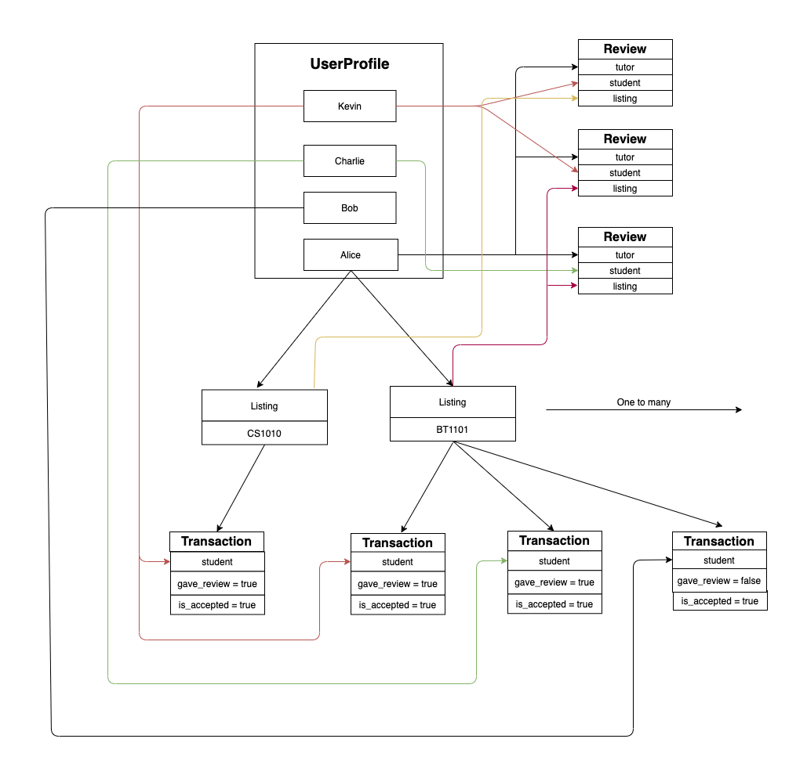

#### Single-page Application (SPA)

In traditional webpages, navigating to a new path on a webpage requires you to load an entire new page from the ground up. This may cause long load times, and poorer user experience. Thankfully, it is easy to build a SPA with React and its third party libraries (mainly react-router-dom). With single-page applications, only necessary React components are reloaded each time a user goes to a new path, thereby decreasing load times and providing a smoother, and snappier user experience.

Auditing using Google Lighthouse, our production website achieves a Time to interactive of 2.0s, which is a measure how long it takes a page to become fully interactive. 

>>>>>  gd2md-html alert: inline image link here (to images/image18.png). Store image on your image server and adjust path/filename/extension if necessary.  (<a href="#">Back to top</a>)(<a href="#gdcalert19">Next alert</a>) >>>>> 

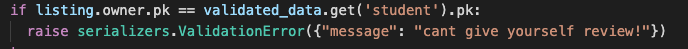

### **Gamification System**

Our gamification system allows for tutors to be rewarded with experience points (exp) to gain levels.

Currently, when a user gives a review, the backend calculates the exp gained for the tutor for that review, and updates the tutor’s total exp. Whenever the frontend fetches a user profile, it gets the raw experience points, and calculates it into levels using a utility function defined in the frontend.

Our leveling system works as follow:

1. For every 200 experience points, users gain a level.
2. Tiering system
    1. Basic tier (Level 1-10)
    2. Silver tier (Level 11-30)
    3. Gold Tier (Level 31 - 70)
    4. Diamond tier (> Level 71) 
3. Experience points are rewarded based on the following formula:  \
_Module level * Rating (out of 5) * 10_

    For example, if Alice gives a review for a module **CS2100** with a rating of** 4**, the tutor gets 2 * 4 * 10 = 80 exp.

Users are rewarded for pursuing higher levels,  for example:

1. Default sorting of search results by the owner’s exp level/tier

    Doing so provides an incentive for tutors to attain higher tiers, since it would guarantee **increased visibility** for their listings, which could lead to more students and **potentially higher earnings**. 

    For students, pushing listings belonging to higher tier tutors acts as a form of **quality assurance** and ensures that the listings with higher visibility are reliable and trustworthy.

2. Tiering and badge system (Basic/Silver/Gold/Diamond tiers)

    Acts as an easy way for users to **identify reliable** and **experienced **tutors, as for tutors to display their hard work.

**Advantages of Gamification**

User Engagement & motivation

Using gamification allows us to improve **user engagement** and **investment**. By rewarding experience points which add up to show a user’s progress as well as badges which show their level of accomplishment, it provides social incentives for continued progress by intrinsically **motivating users to improve** and compete with their peer users. This provides a layer of motivation through** incentivization**, allowing users to become **more engaged** and ensuring **user loyalty.** Down the line, more incentives can also be added such as referrals and rewards for achieving certain tiers. 

### **Security Measures**

We have put in place permissions classes in our backend to ensure that users are only allowed to perform CRUD operations only when they are authorized to do so. Furthermore, the following additional security features are implemented:

1. CSRF Token

    When users sign in, the backend (Django) issues a CSRF token to the user. The user then uses this token as a means to authorize themselves when performing CRUD actions that require a higher level of permission.

2. Password hash using Argon2

    Upon registration, passwords of users are hashed using [Argon2](https://en.wikipedia.org/wiki/Argon2), which provides better protection than older hashes such as MD5 or SHA1, mainly due to the better resistance against GPU attacks. Passwords are hidden from the JSON responses returned from the backend, and therefore preventing users’ password from being stolen in the case of  man-in-the-middle attacks.

3. Django Superuser

    Django provides us with a default admin panel, that allows admins (us) to have access to the entire server and database entries. This allows us to debug easily, and it is also a way to punish users who  abuse the system.

### **Security Vulnerabilities**

We acknowledge a few security shortcomings in our project, particularly vulnerability against Denial-Of-Service attacks. This may occur when malicious actors flood our website with traffic and throwaway accounts with spam emails. In the future, this can be prevented by  validation checks in the backend to detect bot accounts. Additionally, the primary key (Pk) for users is currently generated in increments of 1. By calling the endpoints with an appropriate auth token and primary keys of other users, malicious users can potentially query personal information of other users with their primary keys. This can be circumvented by using UUID generators to add a layer of masking and tighten security of our user endpoint.

### **Database**

#### Models

The following are the implemented django models used for our web application.

**User model **

* Default django user model used for authentication/authorization purposes only
* This is the model created when users sign up with their first name, last name, email, and password
* Django implements this model with other related tables for features such as email verification

**User Profile model **

* Custom user profile model used to store all necessary fields needed for our use case
* An instance of this model is generated automatically each time a user signs up and creates a User Model.

**Listing model **

* Stores the necessary information needed by listings

**Transaction model **

* This serves as a holding area between the user journey where:

    User requests to be a student → tutor accepts student → student gives review

**Review model **

* Stores the necessary information needed by reviews

#### Relations

Backend Django Model Entity Relationship Diagram (ERD)

**Click [here](https://drive.google.com/file/d/1gS6jC474In5zN8JZ8E1hD42gKWe9t3hj/view?usp=sharing) to view the diagram in higher resolution.**

>>>>>  gd2md-html alert: inline image link here (to images/image19.png). Store image on your image server and adjust path/filename/extension if necessary.  (<a href="#">Back to top</a>)(<a href="#gdcalert20">Next alert</a>) >>>>> 

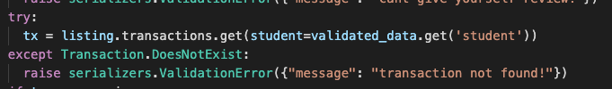

Generated by DataGrip (note: some tables are not shown as they are deemed irrelevant) \

Examples (NOTE: only relevant/important fields are shown in the diagram)

Simple example: 

**Click [here](https://drive.google.com/file/d/1o5--KgCjaq2MH7CoFEVxnqbz1unT-iLt/view?usp=sharing) to view the diagram in higher resolution.**

>>>>>  gd2md-html alert: inline image link here (to images/image20.png). Store image on your image server and adjust path/filename/extension if necessary.  (<a href="#">Back to top</a>)(<a href="#gdcalert21">Next alert</a>) >>>>> 

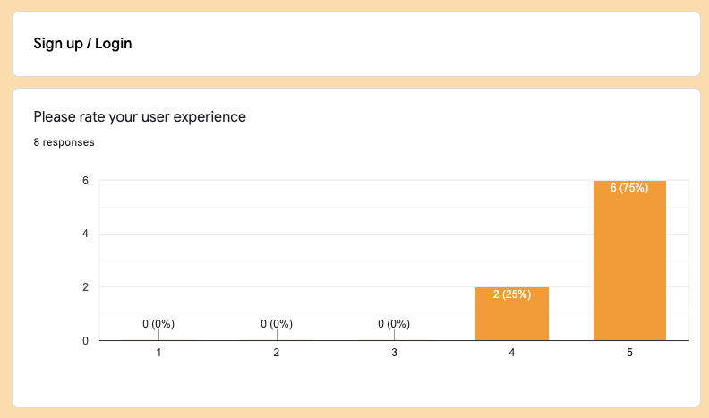

In this example, we have 4 students, Alice, Bob, Charlie and Kevin.

Alice is the sole tutor in this example, with two listings, CS1010 and BT1101.

For CS1101, there is one student, Kevin, who is an accepted student and has given his review.

For BT1101, there are 3 students, Kevin, Charlie and Bob. They are all accepted students, but Bob has not given his review.

A transaction instance is created once a user requests to be a student, and it is pegged to the listing which the user requests on, so that all related fields can be accessed.

More complex example:

**Click [here](https://drive.google.com/file/d/11ANu4FLB8jidT33gMhpf9yVqi-pqVu1H/view?usp=sharing) to view the diagram in higher resolution.**

>>>>>  gd2md-html alert: inline image link here (to images/image21.png). Store image on your image server and adjust path/filename/extension if necessary.  (<a href="#">Back to top</a>)(<a href="#gdcalert22">Next alert</a>) >>>>> 

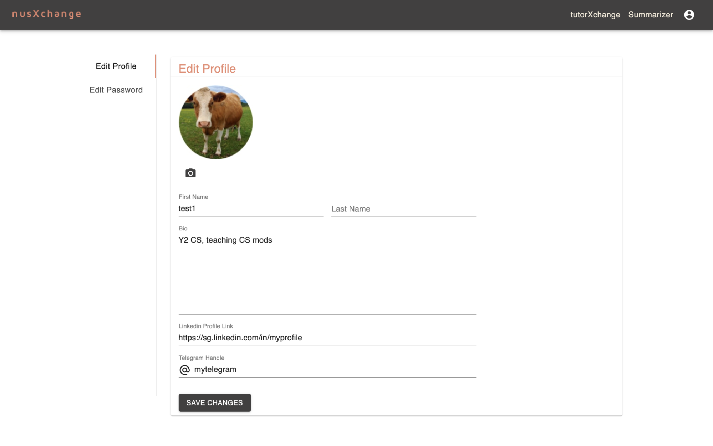

In this example, we have 3 students, Alice, Charlie and Kevin.

Alice and Charles are tutors in this example.

This example introduces more complexity because Kevin is a student of Charles for a GE module, and Charles is a student of Kevin for a BT module.

In this example, all users are accepted students and  have given their reviews.

A transaction instance is created once a user requests to be a student, and it is pegged to the listing which the user requests on, so that all related fields can be accessed.

#### Rationale

Other than being able to store the necessary fields for each model, the implementation of our proposed database relations allow us to achieve the following more non-trivial goals:

1. We are able to calculate the average rating **per module**
2. Upon deletion of a listing
    1. Related transactions are deleted as well
    2. Reviews that were previously given are still persisted on the user’s profile
3. We are able to keep track of the user's status with respect to a listing (listing owner?/ student who is accepted?/student who has given review?)

### **API Endpoints**

**Click [here](nusxchange.herokuapp.com/api/) to see the API endpoints on the deployment site through django’s Browsable API. (Note, endpoints not shown in /api/ still exists, however you have to go to the direct link to see e.g /api/user/3)**

<table>
  <tr>
   <td colspan="4" ><strong>Endpoints</strong>
   </td>
  </tr>
  <tr>
   <td>Purpose
   </td>
   <td>Endpoint
   </td>
   <td>Authentication/

Authorization
   </td>
   <td>Request type/crud type
   </td>
  </tr>
  <tr>
   <td>To access /user/:id
   </td>
   <td>user/&lt;user id>
   </td>
   <td>anyone
   </td>
   <td>get/retrieve
   </td>
  </tr>
  <tr>
   <td>To edit user profile 
   </td>
   <td>user/&lt;user id>
   </td>
   <td>owner
   </td>
   <td>patch/update
   </td>
  </tr>
  <tr>
   <td>Search (mod code or user)
   </td>
   <td>listings/?mod_code=&lt;mod_code>

listings/?user=&lt;user id>
   </td>
   <td>anyone
   </td>
   <td>get/list
   </td>
  </tr>
  <tr>
   <td>To access /listing/:id
   </td>
   <td>listings/&lt;listing id>/
   </td>
   <td>anyone
   </td>
   <td>get/retrieve
   </td>
  </tr>
  <tr>
   <td>Create a listing
   </td>
   <td>listings/
   </td>
   <td>Authenticated users
   </td>
   <td>post/create
   </td>
  </tr>
  <tr>
   <td>Edit listing
   </td>
   <td>listings/&lt;listing id>/
   </td>
   <td>owner
   </td>
   <td>patch/update
   </td>
  </tr>
  <tr>
   <td>Delete listing
   </td>
   <td>listings/&lt;listing id>/
   </td>
   <td>owner
   </td>
   <td>delete/destroy
   </td>
  </tr>
  <tr>
   <td>Request to be a student 
   </td>
   <td>tx/
   </td>
   <td>Authenticated users
   </td>
   <td>post/create
   </td>
  </tr>
  <tr>
   <td>Accept a student 
   </td>
   <td>tx/accept/?listing=&lt;listing id>&student=&lt;student user id>
   </td>
   <td>Owner of listing
   </td>
   <td>get/retrieve
   </td>
  </tr>
  <tr>
   <td>Check status of user wrt listing 
   </td>
   <td>tx/&lt;listing id>/status/
   </td>
   <td>Authenticated users
   </td>
   <td>get/retrieve
   </td>
  </tr>
  <tr>
   <td>Return list of students wrt listing 
   </td>
   <td>tx/&lt;listing id>/students/
   </td>
   <td>Authenticated users
   </td>
   <td>get/retrieve
   </td>
  </tr>
  <tr>
   <td>Return list of tutors
   </td>
   <td>tx/tutors/
   </td>
   <td>Authenticated users
   </td>
   <td>get/retrieve
   </td>
  </tr>
  <tr>
   <td>Create a review
   </td>
   <td>reviews/
   </td>
   <td>Student of tutor
   </td>
   <td>post/create
   </td>
  </tr>
  <tr>
   <td>Get reviews by user id
   </td>
   <td>reviews/&lt;user id>
   </td>
   <td>anyone
   </td>
   <td>get/retrieve
   </td>
  </tr>
</table>

Our endpoints have various validation checks and authentication checks.

For authentication checks, the backend checks if the user corresponding to the  token sent in the HTTP request has a valid read/write access as defined on the backend.

For validation checks, here are some examples:

For transactions,

1. A user can’t create a transaction with themselves.

>>>>>  gd2md-html alert: inline image link here (to images/image22.png). Store image on your image server and adjust path/filename/extension if necessary.  (<a href="#">Back to top</a>)(<a href="#gdcalert23">Next alert</a>) >>>>> 

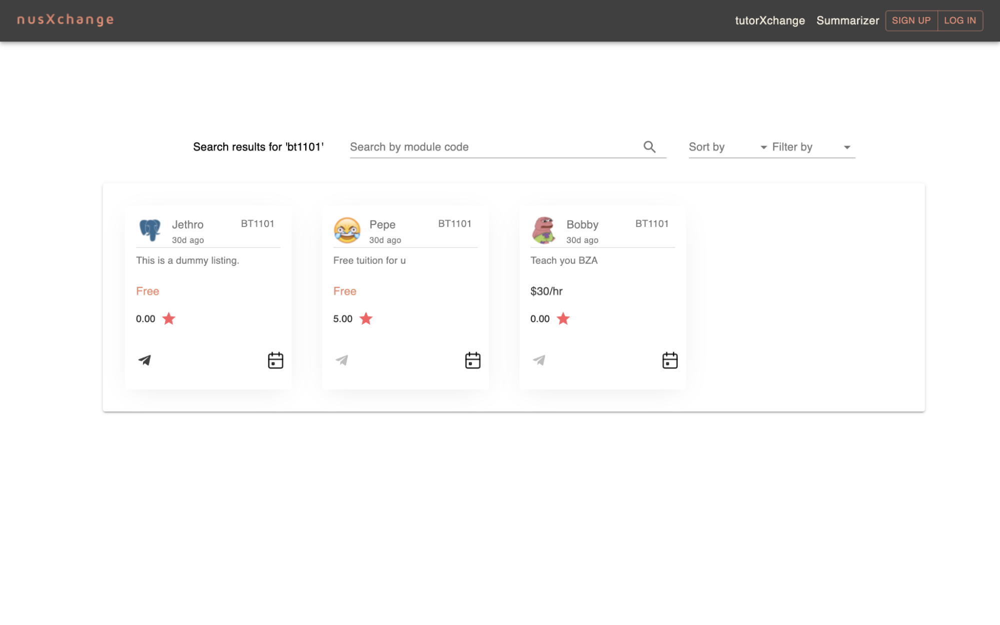

2. There should not be a duplicate transaction with the same listing and student

>>>>>  gd2md-html alert: inline image link here (to images/image23.png). Store image on your image server and adjust path/filename/extension if necessary.  (<a href="#">Back to top</a>)(<a href="#gdcalert24">Next alert</a>) >>>>> 

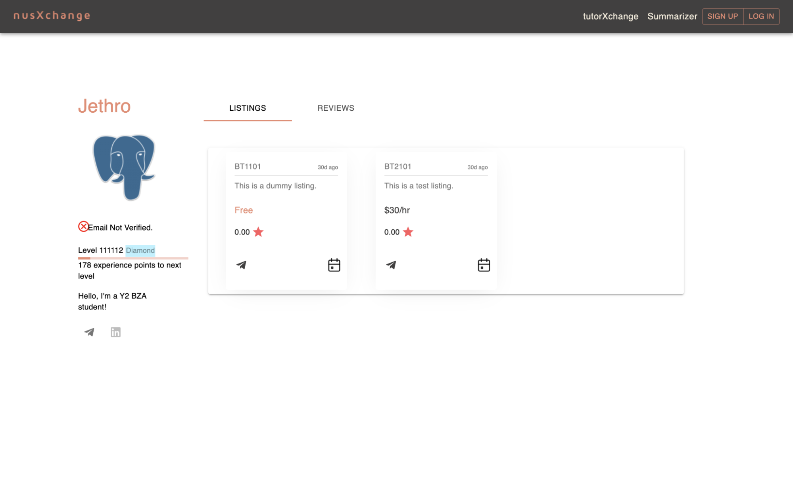

For reviews,

1. A user cant give himself a review

>>>>>  gd2md-html alert: inline image link here (to images/image24.png). Store image on your image server and adjust path/filename/extension if necessary.  (<a href="#">Back to top</a>)(<a href="#gdcalert25">Next alert</a>) >>>>> 

2. Returns error if transaction cant be found with respect to student and listing

>>>>>  gd2md-html alert: inline image link here (to images/image25.png). Store image on your image server and adjust path/filename/extension if necessary.  (<a href="#">Back to top</a>)(<a href="#gdcalert26">Next alert</a>) >>>>> 

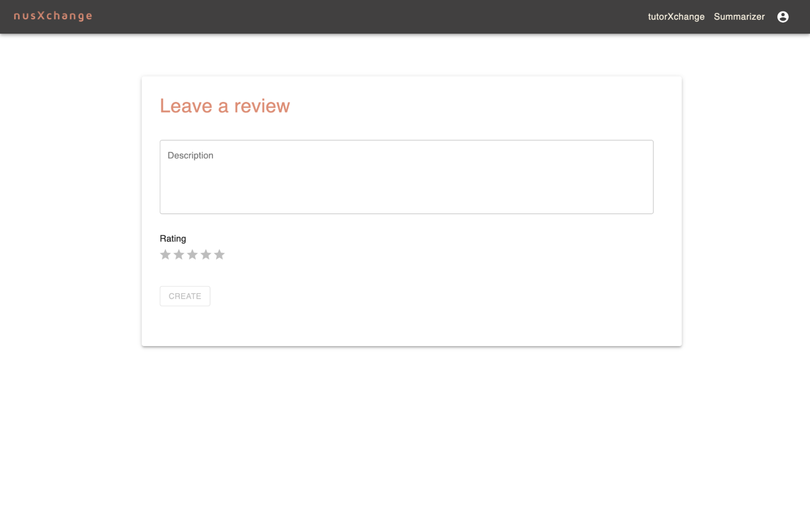

3. Returns error if student has not been accepted or has already given a review

>>>>>  gd2md-html alert: inline image link here (to images/image26.png). Store image on your image server and adjust path/filename/extension if necessary.  (<a href="#">Back to top</a>)(<a href="#gdcalert27">Next alert</a>) >>>>> 

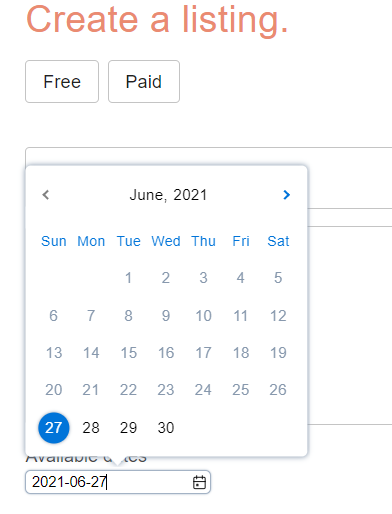

### **Testing**

#### Frontend

Unit testing

[Jest](https://jestjs.io/) was used to unit test our frontend. Jest allows us to build tests quickly without compromising our test quality, thanks to its simple and zero-config framework. 

For each page , we ensured it can be rendered correctly through the following ways:

1. The page renders correctly without errors.
2. We developed tests to mimic clicking and logged the answers for components that are interactable (through a button click or other action) to verify if the components are operating as planned. 
3. We tested with edge cases on components that have input limits (for example, a certain input must be less than 5 for the function to output a value), to check that they work as intended and that there are no unwanted outputs.

Also, we tested the reused abstracted components and functions to work as expected.

User testing

We conducted user testing to identify any issues with the app during real-world use and to bring out any design flaws that we may have overlooked throughout the ideation process. Doing so allows us to better personalize the app to users and enhance the UI/UX with feedback garnered. 

Any serious bugs that snuck through the other tests or any blindspots that we may have missed can therefore be fixed promptly.

(snippets of survey form on next page)

Snippets of the survey responses:

>>>>>  gd2md-html alert: inline image link here (to images/image27.png). Store image on your image server and adjust path/filename/extension if necessary.  (<a href="#">Back to top</a>)(<a href="#gdcalert28">Next alert</a>) >>>>> 

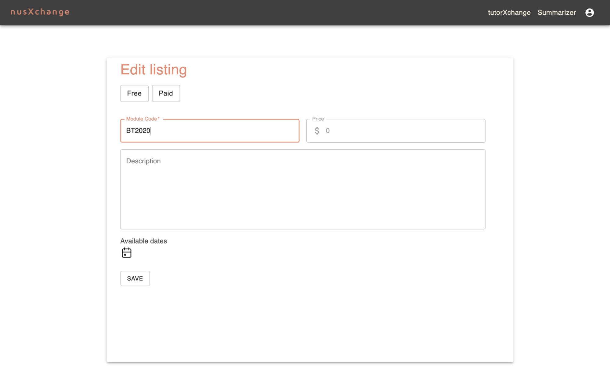

>>>>>  gd2md-html alert: inline image link here (to images/image28.png). Store image on your image server and adjust path/filename/extension if necessary.  (<a href="#">Back to top</a>)(<a href="#gdcalert29">Next alert</a>) >>>>> 

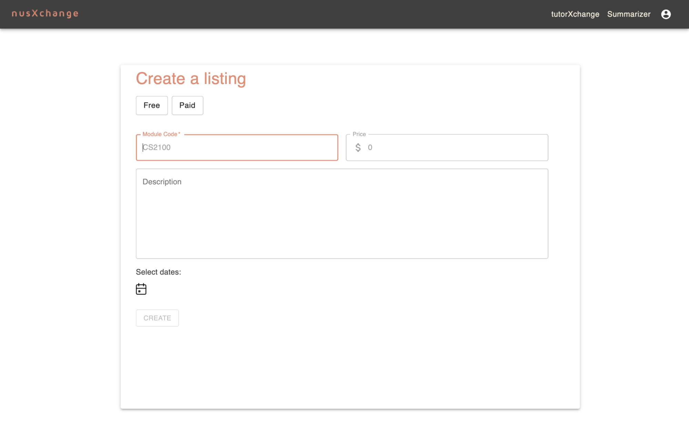

Written responses:

Overall, users were generally quite satisfied with the design of the website and the user experience. However, certain issues were pointed out, such as better optimisation for mobile as well as a way for us to distinguish listings.

>>>>>  gd2md-html alert: inline image link here (to images/image29.png). Store image on your image server and adjust path/filename/extension if necessary.  (<a href="#">Back to top</a>)(<a href="#gdcalert30">Next alert</a>) >>>>> 

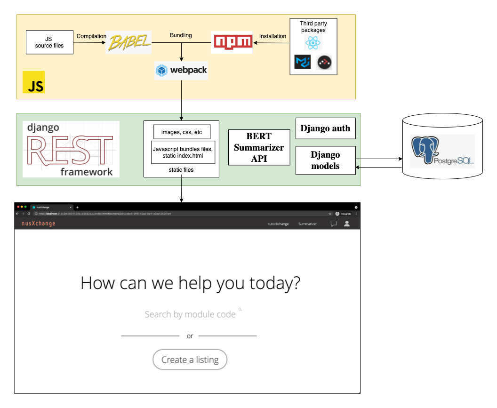

#### Backend

Unit testing

We  used [django-rest-framework test structure](https://www.django-rest-framework.org/api-guide/testing/) to implement unit testing on each of our end points, as it allows us to easily test for endpoint responses and query the database in a single framework.

<table>
  <tr>
   <td colspan="4" >Endpoints testing
   </td>
  </tr>
  <tr>
   <td><strong>Area of focus</strong>
   </td>
   <td><strong>Endpoint</strong>
   </td>
   <td><strong>Test</strong>
   </td>
   <td><strong>Expected result</strong>
   </td>
  </tr>
  <tr>
   <td rowspan="2" >Registration
   </td>
   <td rowspan="2" >/api/auth/register
   </td>
   <td>Register with valid credentials
   </td>
   <td>Receive valid response,

User model created,

UserProfile model created
   </td>
  </tr>
  <tr>
   <td>Register with used email
   </td>
   <td>Receive error response
   </td>
  </tr>
  <tr>
   <td rowspan="2" >Login
   </td>
   <td rowspan="2" >/api/auth/login
   </td>
   <td>Login with valid credentials
   </td>
   <td>Receive valid response,

Token generated in db
   </td>
  </tr>
  <tr>
   <td>Login with invalid credentials
   </td>
   <td>Receive error response
   </td>
  </tr>
  <tr>
   <td rowspan="3" >User Profile
   </td>
   <td rowspan="2" >/api/user/&lt;user id>
   </td>
   <td>Get user profile
   </td>
   <td>Receive valid response
   </td>
  </tr>
  <tr>
   <td>Update user profile 
   </td>
   <td>Receive valid response,

UserProfile model updated 
   </td>
  </tr>
  <tr>
   <td>-
   </td>
   <td>Permissions test
   </td>
   <td>Create: Authenticated users

Read: Anyone

Update: Owner
   </td>
  </tr>
  <tr>
   <td rowspan="5" >Listing
   </td>
   <td>/api/listings/
   </td>
   <td>Create a listing
   </td>
   <td>Receive valid response,

Listing persisted in db
   </td>
  </tr>
  <tr>
   <td rowspan="3" >/api/listings/&lt;listing id>
   </td>
   <td>Retrieve listing by id
   </td>
   <td>Receive valid response
   </td>
  </tr>
  <tr>
   <td>Update a listing
   </td>
   <td>Receive valid response,

Listing updated in db
   </td>
  </tr>
  <tr>
   <td>Delete a listing
   </td>
   <td>Receive valid response,

Listing deleted in db
   </td>
  </tr>
  <tr>
   <td>-
   </td>
   <td>Permissions test
   </td>
   <td>Create: Authenticated users

Read: Anyone

Update: Owner

Delete: Owner
   </td>
  </tr>
  <tr>
   <td rowspan="7" >Transaction
   </td>
   <td rowspan="2" >/api/tx/
   </td>
   <td>Create a transaction with valid listing
   </td>
   <td>Receive valid response,

Transaction persisted in db
   </td>
  </tr>
  <tr>
   <td>Create a transaction with valid listing when transaction already exists
   </td>
   <td>Receive error response
   </td>
  </tr>
  <tr>
   <td>/api/tx/accept/?listing=&lt;listing id>&student=&lt;student user id>
   </td>
   <td>Approve a transaction with valid listing and student id
   </td>
   <td>Receive valid response,

Transaction updated in db
   </td>
  </tr>
  <tr>
   <td>/api/tx/&lt;listing id>/status/
   </td>
   <td>Get user status with respect to a listing
   </td>
   <td>Receive valid response,
   </td>
  </tr>
  <tr>
   <td>/api/tx/&lt;listing id>/students/
   </td>
   <td>List of students with respect to a listing
   </td>
   <td>Receive valid response
   </td>
  </tr>
  <tr>
   <td>/api/tx/tutors/
   </td>
   <td>List of tutors
   </td>
   <td>Receive valid response
   </td>
  </tr>
  <tr>
   <td>-
   </td>
   <td>Permissions test
   </td>
   <td>Create: Authenticated users

Retrieve: Authenticated users

Update: Owner of listing
   </td>
  </tr>
  <tr>
   <td rowspan="5" >Review
   </td>
   <td rowspan="3" >/api/reviews/
   </td>
   <td>Create a review when user is accepted
   </td>
   <td>Receive valid response, exp levels calculated correctly and tutor’s profile instance  updated, student’s transaction instance’s gave_review set to true
   </td>
  </tr>
  <tr>
   <td>Create a review when user is not accepted
   </td>
   <td>Receive error response
   </td>
  </tr>
  <tr>
   <td>Create a review when user has already made the review with the corresponding tutor and listing
   </td>
   <td>Receive error response
   </td>
  </tr>
  <tr>
   <td>/api/reviews/&lt;user id>
   </td>
   <td>List reviews by user id
   </td>
   <td>Receive valid response
   </td>
  </tr>
  <tr>
   <td>-
   </td>
   <td>Permissions test
   </td>
   <td>Create: Accepted students

Retrieve: Anyone
   </td>
  </tr>
</table>

Database relations testing

We created entries in the database that correspond to the diagrams in the examples of the [Database Relations](#bookmark=id.wo6i3dcswm5w) section through endpoint calls, thereby creating the corresponding database relations.

Then, we tested to ensure that the expected entries exist in the database with the correct fields, and that no extra entries were incorrectly or accidentally created. 

Finally, we deleted listings through endpoint calls, and tested that the corresponding related entries were still correctly persisted (reviews) and deleted (transactions).

#### Test Results 

As we have already manually tested our frontend and backend beforehand, all our tests seem to pass as expected. Therefore, no further action was needed to rectify any known problem. 

However, we do admit that instead of leaving test cases to the last, we should have gone for Test Driven Development from the start, so as to improve the overall code quality and correctness, and to catch bugs early.

### **Limitations**

Although we managed to push out our core features, we regrettably did not manage to push out all the feature extensions for Milestone 3 due to time constraints. These features could have  greatly enhanced the user experience as a whole, and make the app more complete. We are still in the midst of figuring out if we are able to implement these before the final submission date.

The following feature extensions could not be implemented in time:

1. [Stream](https://getstream.io/) (Third party advanced chat/push notification service)
2. Mobile friendly web app
3. Social login
4. Leaderboard
5. Pdf scraper for summarizer

 

### **Challenges and Lessons Learnt**

#### Tech Stack

Initially, we chose React and Django as they are two very popular frameworks that are being used in the industry, and therefore we thought that it would be good to gain hands-on experience on these frameworks. However, given the steep learning curve of these frameworks, the time constraint of Orbital, and the fact that both of us were relatively new to web development, we ended up spending an excessive amount of time trying to learn and debug the nitty-gritty parts of the framework. This is especially true for older frameworks like django-rest-framework, where resources and third party packages are often deprecated, outdated or abandoned, which leads to wasted time. This inevitably caused us to compromise on the number of features that we were able to push out, and the overall quality of the app. Moving forward, we would like to try out newer technologies like frontend server-side rendering frameworks (e.g Next.js) and serverless backends (e.g firebase, aws lambda, etc.). These technologies may ultimately improve development speed, and the responsiveness, scalability and security of our application.

#### Prototyping and Collaborative work

In the early days of orbital, both of us did not have a concrete picture of how our project would look like (UI/UX) as well as the backend requirements. This led to a general lack of direction and focus in our project. The turning point was when we decided to pour our efforts into creating a high-fidelity prototype which contained all the pages we envisaged and a unified design. Slowly, our project began to take shape and it was easier to understand both the design as well as technical requirements of the project, since prototyping allowed us to gain a deeper understanding of our project. Another learning point was the collaborative aspect of orbital and having a partner. Having someone to discuss implementations and bounce ideas off really enhanced the development process as we were able to learn from one another and deliberate over the direction of the project. We also picked up some project management tools such as Trello and Git which would definitely be useful in the future.

## **Appendix (User Guide)**

Fully expanded navbar: 

>>>>>  gd2md-html alert: inline image link here (to images/image30.png). Store image on your image server and adjust path/filename/extension if necessary.  (<a href="#">Back to top</a>)(<a href="#gdcalert31">Next alert</a>) >>>>> 

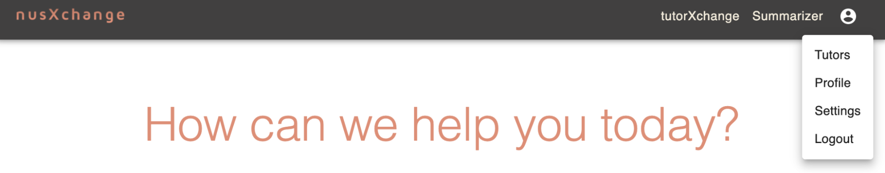

As an anonymous user, I can do the following...

1. Access tutorXchange (landing page) (/)

    

>>>>>  gd2md-html alert: inline image link here (to images/image31.png). Store image on your image server and adjust path/filename/extension if necessary.  (<a href="#">Back to top</a>)(<a href="#gdcalert32">Next alert</a>) >>>>> 

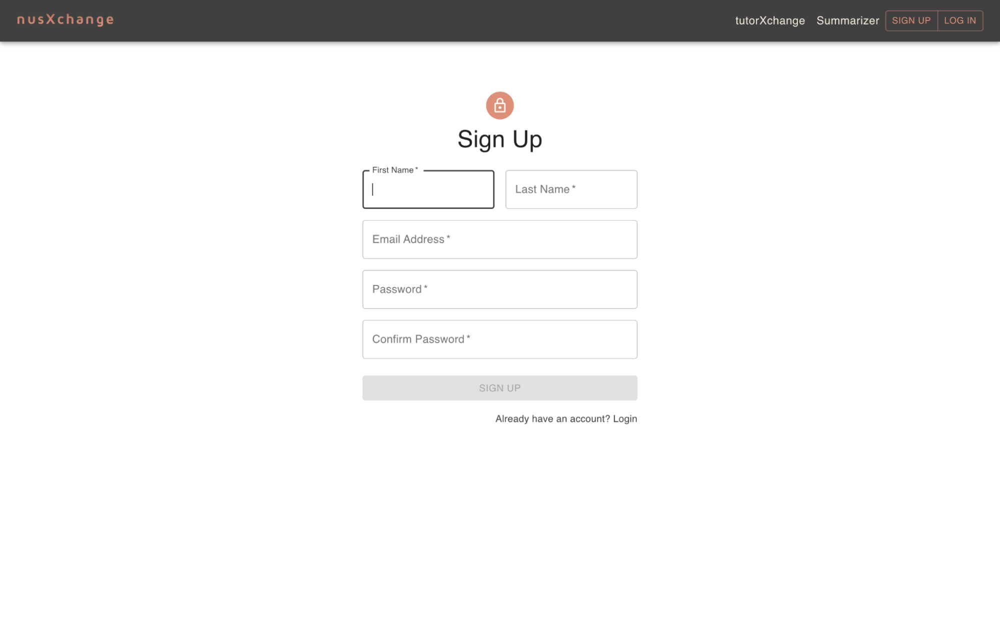

    1. Search for listing (/search/{query})

        Can sort by price, rating, or date created

        Can filter by available dates

        [Default sorting: by level]

        

>>>>>  gd2md-html alert: inline image link here (to images/image32.png). Store image on your image server and adjust path/filename/extension if necessary.  (<a href="#">Back to top</a>)(<a href="#gdcalert33">Next alert</a>) >>>>> 

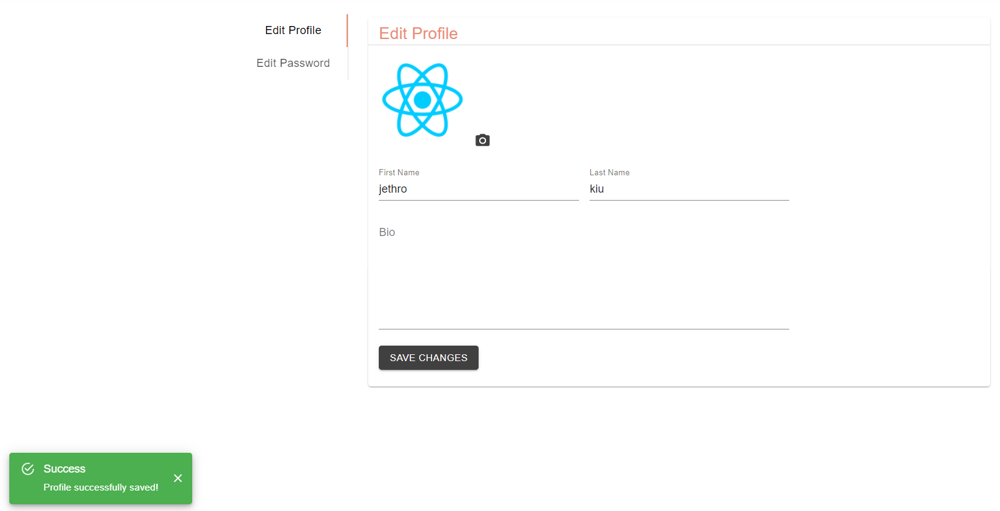

    2. Click into the listing card for a more detailed view of the listing. (/listing/{id})

        Here, you can contact the tutor via telegram, and receive more information about the tutor through linkedin.

        

>>>>>  gd2md-html alert: inline image link here (to images/image33.png). Store image on your image server and adjust path/filename/extension if necessary.  (<a href="#">Back to top</a>)(<a href="#gdcalert34">Next alert</a>) >>>>> 

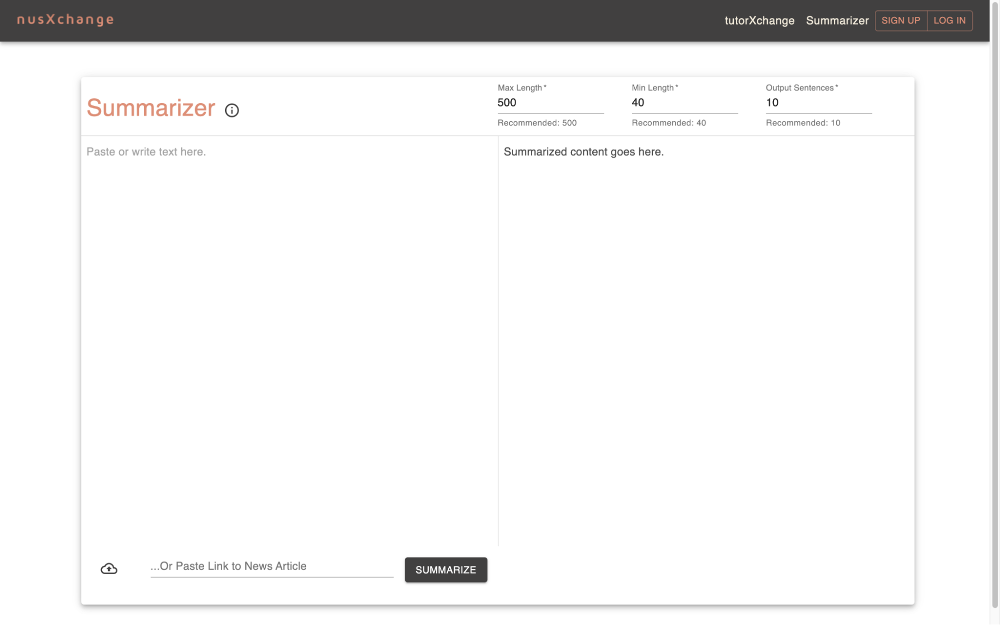

    3. Click into tutor profile to view more information {/profile/{id})

        

>>>>>  gd2md-html alert: inline image link here (to images/image34.png). Store image on your image server and adjust path/filename/extension if necessary.  (<a href="#">Back to top</a>)(<a href="#gdcalert35">Next alert</a>) >>>>> 

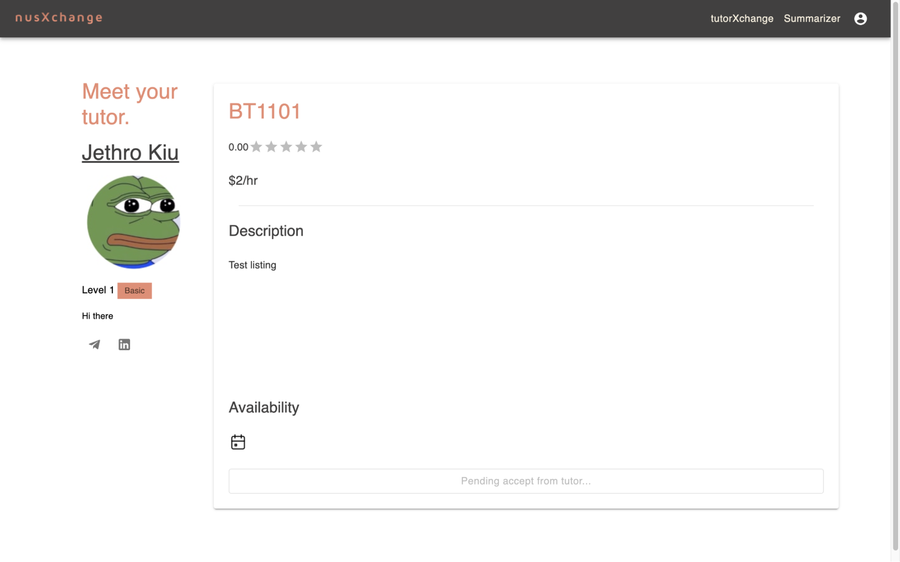

        

>>>>>  gd2md-html alert: inline image link here (to images/image35.png). Store image on your image server and adjust path/filename/extension if necessary.  (<a href="#">Back to top</a>)(<a href="#gdcalert36">Next alert</a>) >>>>> 

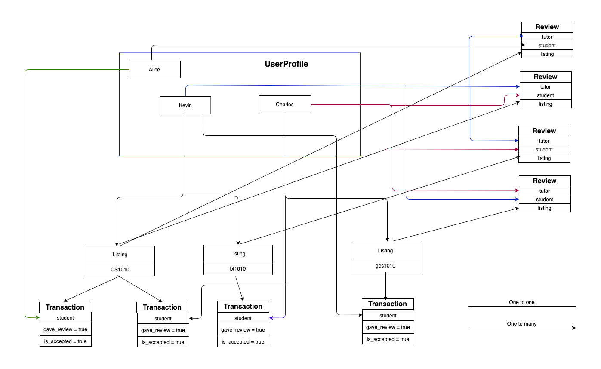

2. Access Summarizer (/summarizer)

    Either:

1. Paste your long text, key in your parameters, and click summarize
2. Paste a news link, key in your parameters, and click summarize

    

>>>>>  gd2md-html alert: inline image link here (to images/image36.png). Store image on your image server and adjust path/filename/extension if necessary.  (<a href="#">Back to top</a>)(<a href="#gdcalert37">Next alert</a>) >>>>> 

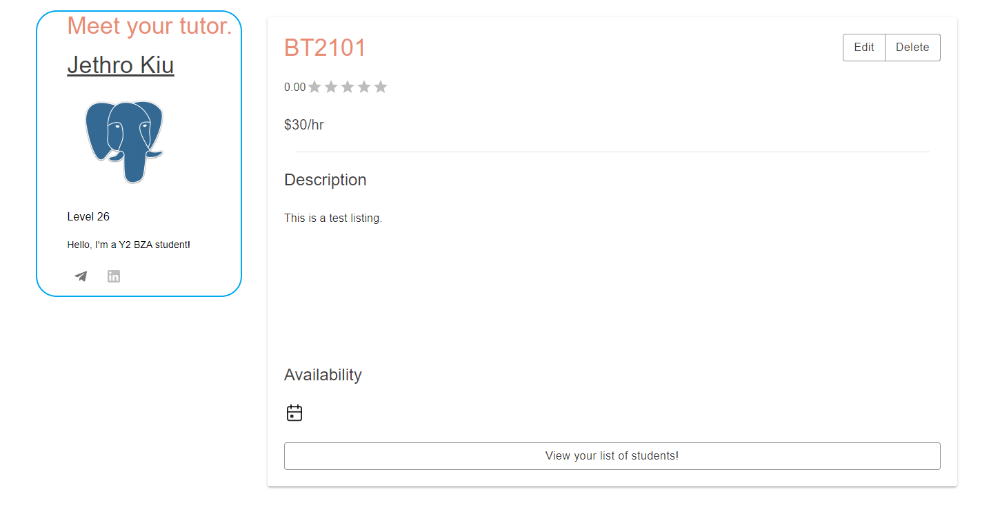

Authentication

1. Sign up (/signup)

    

>>>>>  gd2md-html alert: inline image link here (to images/image37.png). Store image on your image server and adjust path/filename/extension if necessary.  (<a href="#">Back to top</a>)(<a href="#gdcalert38">Next alert</a>) >>>>> 

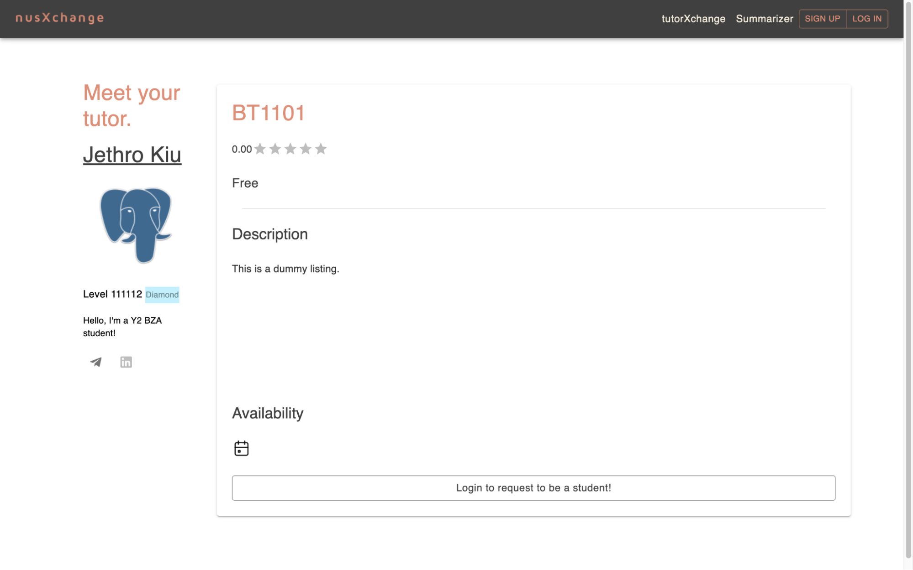

2. Login (/login)

    

>>>>>  gd2md-html alert: inline image link here (to images/image38.png). Store image on your image server and adjust path/filename/extension if necessary.  (<a href="#">Back to top</a>)(<a href="#gdcalert39">Next alert</a>) >>>>> 

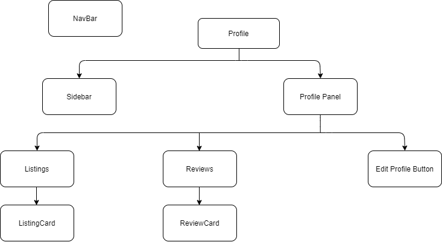

    1. Forgot password (email will be sent to you) (/forgot-password)

        

>>>>>  gd2md-html alert: inline image link here (to images/image39.png). Store image on your image server and adjust path/filename/extension if necessary.  (<a href="#">Back to top</a>)(<a href="#gdcalert40">Next alert</a>) >>>>> 

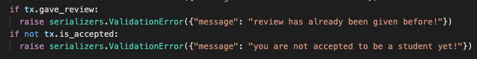

As a logged in user, I can do whatever an anonymous user can do and the following…

1. Edit profile (/settings)

    

>>>>>  gd2md-html alert: inline image link here (to images/image40.png). Store image on your image server and adjust path/filename/extension if necessary.  (<a href="#">Back to top</a>)(<a href="#gdcalert41">Next alert</a>) >>>>> 

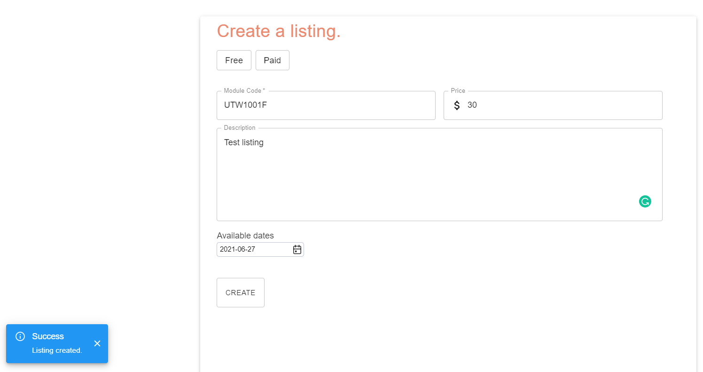

2. Edit password (/settings)

    

>>>>>  gd2md-html alert: inline image link here (to images/image41.png). Store image on your image server and adjust path/filename/extension if necessary.  (<a href="#">Back to top</a>)(<a href="#gdcalert42">Next alert</a>) >>>>> 

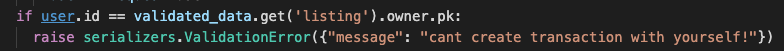

3. Verify email (by clicking “Verify Now” on your own profile page) (/verified)

    

>>>>>  gd2md-html alert: inline image link here (to images/image42.png). Store image on your image server and adjust path/filename/extension if necessary.  (<a href="#">Back to top</a>)(<a href="#gdcalert43">Next alert</a>) >>>>> 

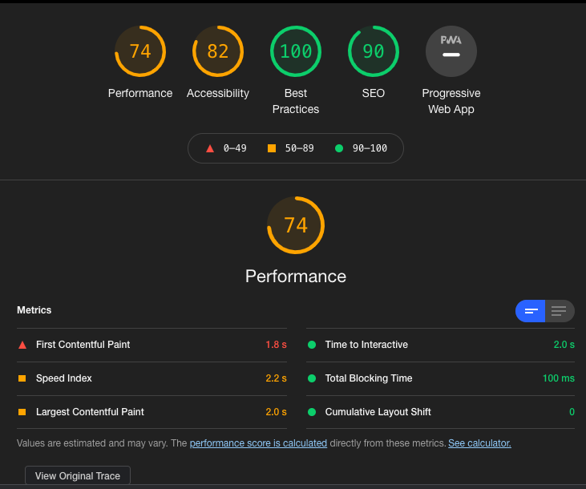

4. Create a listing (/create)

    

>>>>>  gd2md-html alert: inline image link here (to images/image43.png). Store image on your image server and adjust path/filename/extension if necessary.  (<a href="#">Back to top</a>)(<a href="#gdcalert44">Next alert</a>) >>>>> 

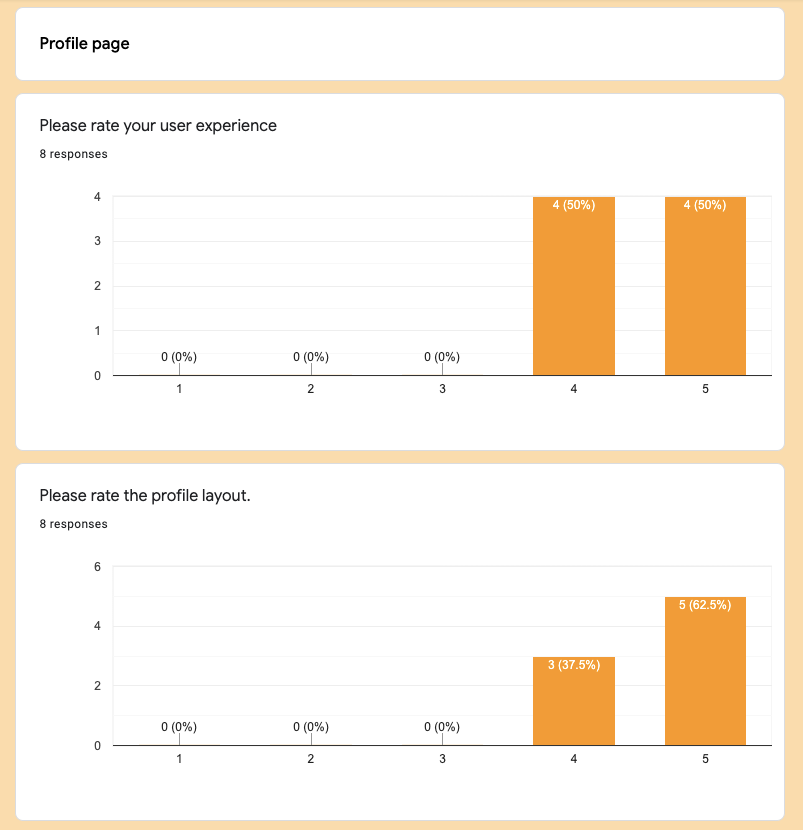

5. Edit/delete listing (/listing/{id}/edit)

    (edit/delete button is on the listing page itself, only shown to owner of listing)

    

>>>>>  gd2md-html alert: inline image link here (to images/image44.png). Store image on your image server and adjust path/filename/extension if necessary.  (<a href="#">Back to top</a>)(<a href="#gdcalert45">Next alert</a>) >>>>> 

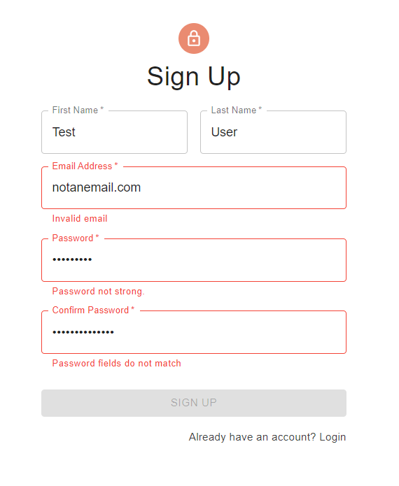

6. View students per listing on my profile page (also can view on detailed listing page)

    

>>>>>  gd2md-html alert: inline image link here (to images/image45.png). Store image on your image server and adjust path/filename/extension if necessary.  (<a href="#">Back to top</a>)(<a href="#gdcalert46">Next alert</a>) >>>>> 

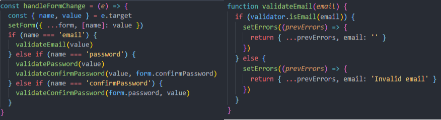

7. Request to be a student via listing page.

     (Button below the calendar shows the user's status with regards to the listing. It can be “Request to be a student”/”Pending accept”/”Leave a review”/”Given review”)

    

>>>>>  gd2md-html alert: inline image link here (to images/image46.png). Store image on your image server and adjust path/filename/extension if necessary.  (<a href="#">Back to top</a>)(<a href="#gdcalert47">Next alert</a>) >>>>> 

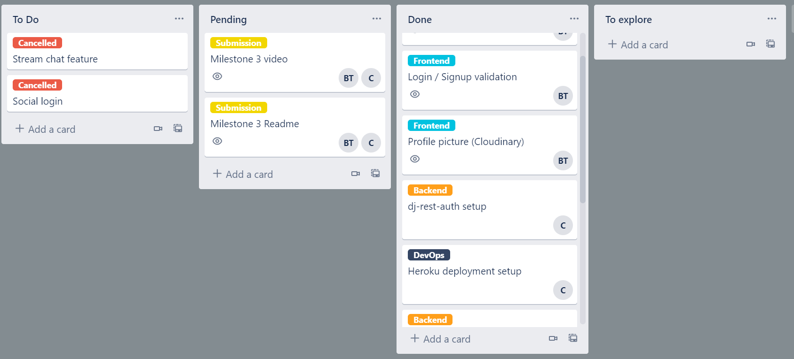

8. View my entire list of tutors (/tutors) 

    

>>>>>  gd2md-html alert: inline image link here (to images/image47.png). Store image on your image server and adjust path/filename/extension if necessary.  (<a href="#">Back to top</a>)(<a href="#gdcalert48">Next alert</a>) >>>>> 

9. Leave a review once the tutor accepts me on tutorXchange (/listing/{id}/review)

    

>>>>>  gd2md-html alert: inline image link here (to images/image48.png). Store image on your image server and adjust path/filename/extension if necessary.  (<a href="#">Back to top</a>)(<a href="#gdcalert49">Next alert</a>) >>>>> 

